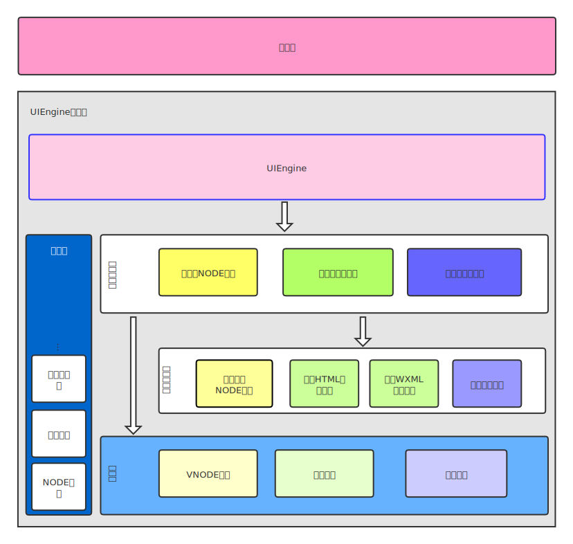

# UIEngine
## 什么是UIEngine？

UIEngine是一个可以将对象树转换成特定的视图的框架。比如可以通过`html-layout`和`theme`转成HTML文件，也可以通过`wxml-layout` 和 `theme`转换成WXML文件。

也可以通过自定义的Layout和Theme，通过UIEngine转换成你自己的目标视图。

## 为什么需要UIEngine？

当我们面临着需要将同一个视图翻译成不同的平台的版本文件时，我们传统的做法是分别对应每个平台写一套视图代码，当需求更改的时候，每一个平台的代码都要相应的更改，这样对开发人员来说是极其繁琐的事情，而且维护成本高，需求完成周期拉长。当你使用UIEngine的时候，在定制好每个平台的基础layout对象后，你只需维护UIEngine的对象树，就能同时产出各个平台的视图代码；而且通过给UIEngine指定不同的主题，可以方便的更换视图的样式，对于动态修改主题的需求来说，这无疑是一个完美的解决方案。

## UIEngine的架构图（逻辑视图）



## Tutorial

#### 自定义组件

```javascript
const { DefaultNode, LayoutNode, ThemeNode, Components } = require('../dist');

const { StringBuilder } = require('../dist/utils/string-utils');
const { resolveStyle, resolveClassList } = require('../dist/utils/node-utils');


const TAG = 'round-img-with-title';
// 虚拟节点继承DefautNode
 class RoundImgWithTitle extends DefaultNode {
  constructor() {
    super();
    this.image = new Components.Image();
    this.text = new Components.Text();
    this.append(this.image);
    this.append(this.text);
    this.tag = TAG;
    this.id = TAG + '-id';
  }

  setSrc (src) {
    this.image.setSrc(src);
  }

  getSrc () {
    return this.attr('src');
  }

  setTitle (title) {
    this.text.setText(title);
  }

  getTitle () {
    return this.text.getTitle();
  }
}

// 组件布局，需要继承LayoutNode
class RoundImgWithTitleLayout extends LayoutNode {
  constructor () {
    super();
    this.tag = TAG;
  }

  render (node) {
    let sb = new StringBuilder;
    let style = resolveStyle(node);
    let classString = resolveClassList(node);

    sb.appendLine(`<div class="${classString}" style="${style}">`);
    node.children.forEach(child => {
      sb.appendLine(child.layoutNode.render(child));
    })
    sb.appendLine('</div>');

    return sb.str();
  }
}

// 主题布局，需要继承ThemeNode
class RoundImgWithTitleTheme extends ThemeNode {
  constructor () {
    super();
    this.tag = TAG;
  }

  inject (node) {
    const kThemeClassList = ['ui-round-image-text'];
    kThemeClassList.forEach(cls => node.addClass(cls));
    return node;
  }
}


module.exports = exports = {
  RoundImgWithTitleTheme,
  RoundImgWithTitle,
  RoundImgWithTitleLayout
};

```

**自定义组件使用**

```javascript
// 自定义组件
let engine = new UIEngine();
// 在布局管理中注册自定义组件的布局
BasicHTMLLayout.registerLayoutNode(new RoundImgWithTitleLayout);
// 在主题管理中注册自定义组件的布局
BasicTheme.registerThemeNode(new RoundImgWithTitleTheme);
let riwt = new RoundImgWithTitle();
riwt.setSrc('https://avatars1.githubusercontent.com/u/1920250?s=60&v=4');
riwt.setTitle('图片title')
engine.useLayout(BasicHTMLLayout);
console.log(engine.render(riwt));

```


## Example

```javascript

const {Components,  UIEngine, BasicTheme, BasicWXMLLayout, BasicHTMLLayout} = require('../dist');
const { Page, Card, Row, Col, Button, Image, Text } = Components;

let page = new Page();

let engine = new UIEngine(page);

let card = new Card().appendTo(page);
card.setTitle('我是卡片的标题');
card.addStyle('marginTop', '20px');
const row = new Row().appendTo(card);

const col1 = new Col().appendTo(row);
col1.setSpan(6);
col1.setGutter(10);
let img1 = new Image();
img1.setSrc('https://avatars1.githubusercontent.com/u/1920250?s=60&v=4');
col1.append(img1);

const col2 = new Col().appendTo(row);
col2.setSpan(6);
col2.setGutter(10);
let button = new Button();
button.setButtonText('我是一个按钮');
col2.append(button);

const col3 = new Col().appendTo(row);
col3.setSpan(6);
col3.setGutter(10);
let img2 = new Image();
img2.setSrc('https://avatars1.githubusercontent.com/u/1920250?s=60&v=4');
img2.addWhiteListAttr('mode');
img2.addAttr('mode', 'aspectFill');
col3.append(img2);

engine.useLayout(BasicHTMLLayout).useTheme(BasicTheme);
let html = engine.render();

engine.useLayout(BasicWXMLLayout);
let wxml = engine.render();

console.log(html);
console.log('\n\n\n');
console.log(wxml);
```

**OUTPUT**

​```html
<div class="ui-page" style="">
  <div class="ui-card" style="margin-top:20px;">
    <div class="ui-card__title"><span>我是卡片的标题</span></div>
    <div class="ui-row" style="">
      <div class="ui-col ui-col-6" style="ui-col ui-col-6">
        <div class="ui-image" style="">
          
        </div>
      </div>
      <div class="ui-col ui-col-6" style="ui-col ui-col-6">
        <button class="ui-button" style="">
          <span>我是一个按钮</span>
        </button>
      </div>
      <div class="ui-col ui-col-6" style="ui-col ui-col-6">
        <div class="ui-image" style="" mode="aspectFill">
          
        </div>
      </div>
    </div>
  </div>
</div>
```

​```html
<view class="ui-page" style="" >
  <view class="ui-card" style="margin-top:20px;" >
  <text class="ui-card__title">我是卡片的标题</text>
      <view class="ui-row" style="" >
          <view class="ui-col ui-col-6" style="padding-left:5px;padding-right:5px;" >
              <view class="ui-image" style="" >
          <image src="https://avatars1.githubusercontent.com/u/1920250?s=60&v=4"/>
        </view>

      </view>

          <view class="ui-col ui-col-6" style="padding-left:5px;padding-right:5px;" >
              <button class="ui-button" style="" >
          <text>我是一个按钮</text>
        </button>

      </view>

          <view class="ui-col ui-col-6" style="padding-left:5px;padding-right:5px;" >
              <view class="ui-image" style=""  mode="aspectFill">
          <image src="https://avatars1.githubusercontent.com/u/1920250?s=60&v=4"/>
        </view>

      </view>

    </view>

  </view>

</view>
```

一张在浏览器中的效果图


